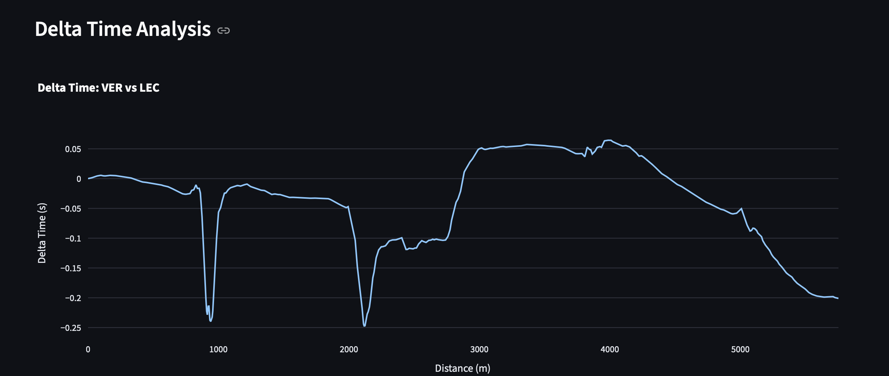
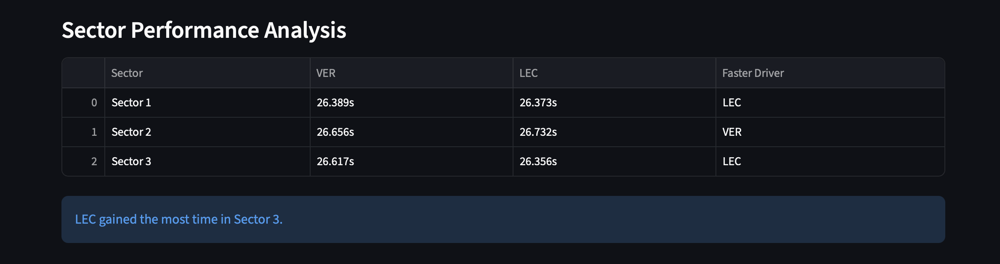
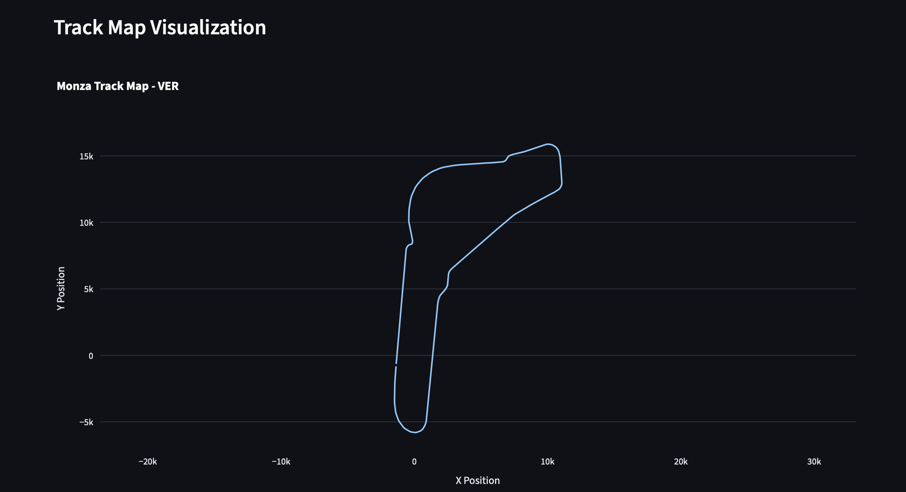
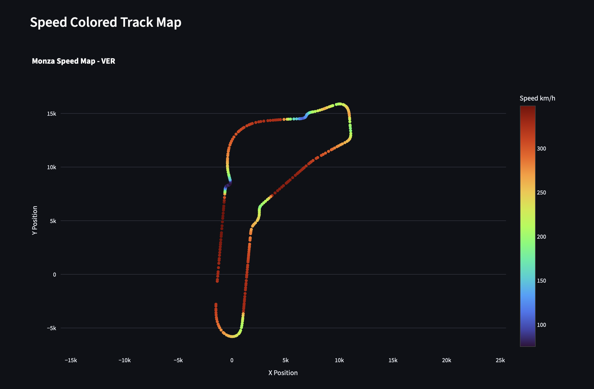
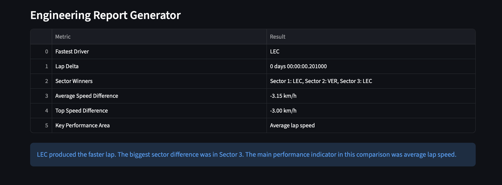

# 🏎️ F1 Race Engineering Portfolio

Professional Formula 1 telemetry analysis, race engineering and motorsport data science projects built with Python.

---

## Overview

This repository contains Formula 1 data analytics projects designed to replicate real-world race engineering workflows.

The objective is to analyze telemetry data, compare driver performance, evaluate race strategy and build engineering-focused decision support tools using real Formula 1 data.

---

# F1 Telemetry Analysis Dashboard

Interactive dashboard for comparing Formula 1 drivers using telemetry data.

## Features

- Fastest Lap Comparison
- Speed Analysis
- Throttle Analysis
- Brake Analysis
- RPM Analysis
- Delta Time Analysis
- Sector Performance Analysis
- Track Map Visualization
- Speed Colored Track Map
- Engineering Report Generator
- Average Speed Comparison
- Top Speed Comparison
- Race Engineer Notes

---

## Technology Stack

- Python
- FastF1
- Streamlit
- Plotly
- Pandas
- NumPy

---

## Dashboard Screenshots

### Main Dashboard


---

### Speed Comparison


---

### Throttle Comparison


---

### Brake Comparison


---

### Delta Time Analysis



---

### Sector Performance Analysis



---

### Track Map Visualization



---

### Speed Colored Track Map



---

### Engineering Report Generator



---

### Race Engineer Notes


---

## Example Analysis

### Session Details

| Parameter | Value |
|------------|--------|
| Season | 2024 |
| Grand Prix | Monza |
| Session | Qualifying |
| Driver 1 | Max Verstappen |
| Driver 2 | Charles Leclerc |

### Analysis Output

The dashboard compares telemetry traces and highlights performance differences in:

- Braking zones
- Corner entry speed
- Corner exit performance
- Acceleration phases
- Top speed sections
- Engine behaviour
- Sector performance
- Overall lap efficiency
- Time gained and lost throughout the lap

---

## Current Development Progress

### Phase 1 — Telemetry Dashboard

- [x] Driver comparison
- [x] Speed analysis
- [x] Brake analysis
- [x] Throttle analysis
- [x] RPM analysis
- [x] Lap delta visualization
- [x] Sector performance analysis
- [x] Track map visualization
- [x] Speed-colored track map
- [x] Engineering report generator
- [x] Average speed comparison
- [x] Top speed comparison
- [x] Race engineer notes

### Phase 2 — Advanced Telemetry

- [ ] Corner-by-corner analysis
- [ ] Racing line comparison
- [ ] Interactive telemetry overlays
- [ ] AI race engineer summary
- [x] Driver comparison report generation

### Phase 3 — Race Strategy Simulator

- [ ] Tire degradation modelling
- [ ] Pit stop optimization
- [ ] Safety car simulations
- [ ] Undercut / Overcut analysis
- [ ] Strategy recommendation engine

### Phase 4 — Machine Learning

- [ ] Lap time prediction
- [ ] Driver performance index
- [ ] Pace forecasting
- [ ] Race outcome prediction

---

## Repository Structure

```text
f1-race-engineering-portfolio/
│
├── README.md
├── requirements.txt
│
├── images/
│   ├── dashboard-overview.png
│   ├── speed-comparison.png
│   ├── throttle-comparison.png
│   ├── brake-comparison.png
│   ├── delta-time-analysis.png
│   ├── sector-analysis.png
│   ├── track-map.png
│   ├── speed-track-map.png
│   ├── engineering-report.png
│   └── race-engineer-notes.png
│
└── telemetry-dashboard/
    ├── dashboard.py
    ├── data/
    │   └── cache/
    ├── notebooks/
    └── src/
```

---

## Future Goal

Build a complete Formula 1 Race Engineering Toolkit capable of supporting telemetry analysis, strategy modelling, performance evaluation and race decision workflows similar to those used in professional motorsport environments.

---

## Author

### Yener Tugra YAVUZ

Motorsport Data Analytics • Artificial Intelligence • Software Engineering

Building a Formula 1 Race Engineering Portfolio through data analytics, simulation and machine learning.