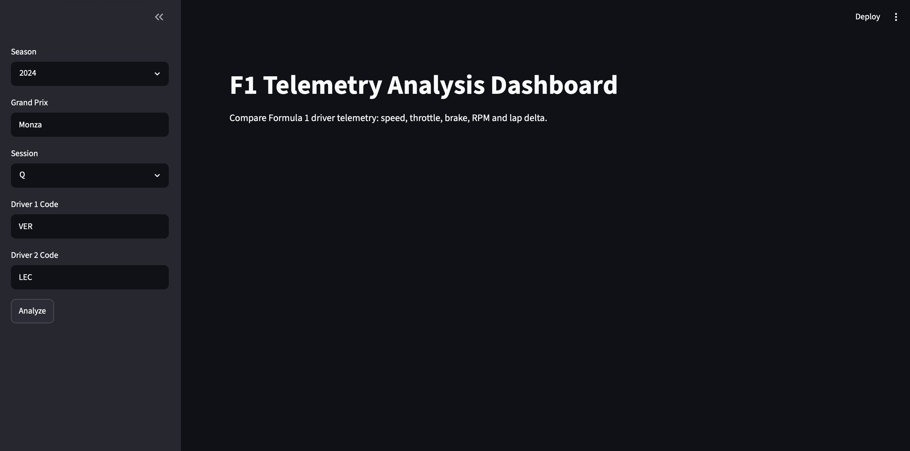
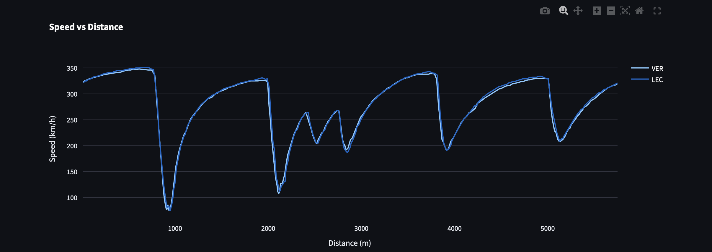
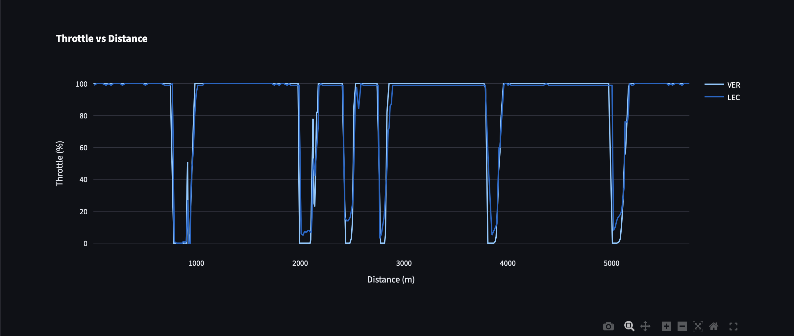
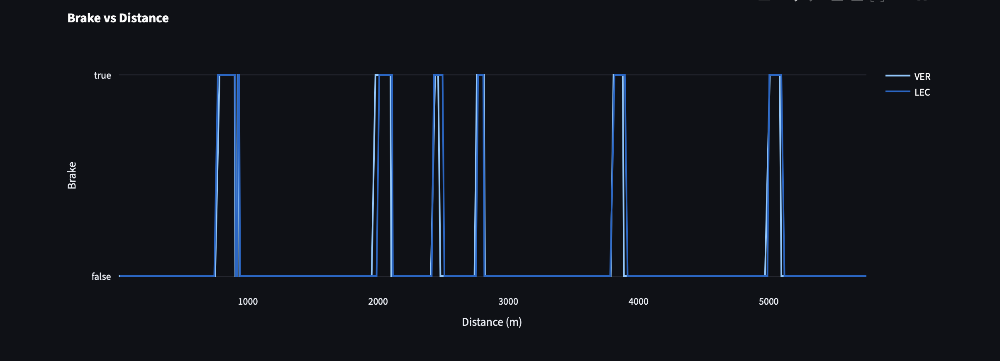
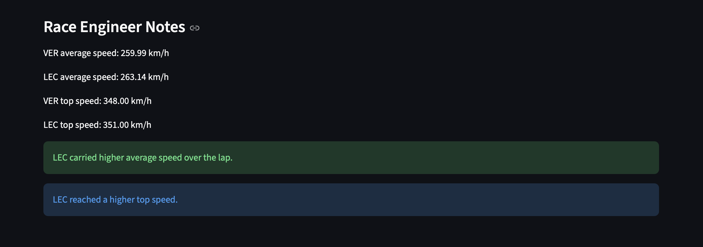

# 🏎️ F1 Race Engineering Portfolio

Professional Formula 1 telemetry analysis, race engineering and motorsport data science projects built with Python.

---

## Overview

This repository contains Formula 1 data analytics projects designed to replicate real-world race engineering workflows.

The objective is to analyze telemetry data, compare driver performance, evaluate race strategy and build engineering-focused decision support tools using real F1 data.

---

# F1 Telemetry Analysis Dashboard

Interactive dashboard for comparing Formula 1 drivers using telemetry data.

## Features

- Fastest Lap Comparison
- Speed Analysis
- Throttle Analysis
- Brake Analysis
- RPM Analysis
- Lap Delta Calculation
- Average Speed Comparison
- Top Speed Comparison
- Race Engineer Notes

---

## Technology Stack

- Python
- FastF1
- Streamlit
- Plotly
- Pandas
- NumPy

---

## Dashboard Screenshots

### Main Dashboard

---

### Speed Comparison

---

### Throttle Comparison

---

### Brake Comparison

---

### Race Engineer Notes

---

## Example Analysis

Example comparison:

- Season: 2024
- Grand Prix: Monza
- Session: Qualifying
- Driver 1: Max Verstappen
- Driver 2: Charles Leclerc

The dashboard compares telemetry traces and highlights performance differences in:

- Braking zones
- Acceleration phases
- Top speed sections
- Engine behaviour
- Overall lap efficiency

---

## Project Roadmap

### Phase 1 — Telemetry Dashboard

- [x] Driver comparison
- [x] Speed analysis
- [x] Brake analysis
- [x] Throttle analysis
- [x] RPM analysis
- [x] Race engineer notes

### Phase 2 — Advanced Telemetry

- [ ] Sector analysis
- [ ] Lap delta visualization
- [ ] Corner-by-corner comparison
- [ ] Track map visualization

### Phase 3 — Race Strategy Simulator

- [ ] Tire degradation modelling
- [ ] Pit stop optimization
- [ ] Safety car simulations
- [ ] Undercut / Overcut analysis

### Phase 4 — Machine Learning

- [ ] Lap time prediction
- [ ] Driver performance index
- [ ] Pace forecasting
- [ ] Strategy recommendation engine

---

## Future Goal

Build a complete Formula 1 Race Engineering Toolkit capable of supporting telemetry analysis, strategy modelling and performance evaluation workflows similar to those used in professional motorsport environments.

---

## Author

### Yener Tugra YAVUZ

Motorsport Data Analytics • Artificial Intelligence • Software Engineering

GitHub Portfolio Project